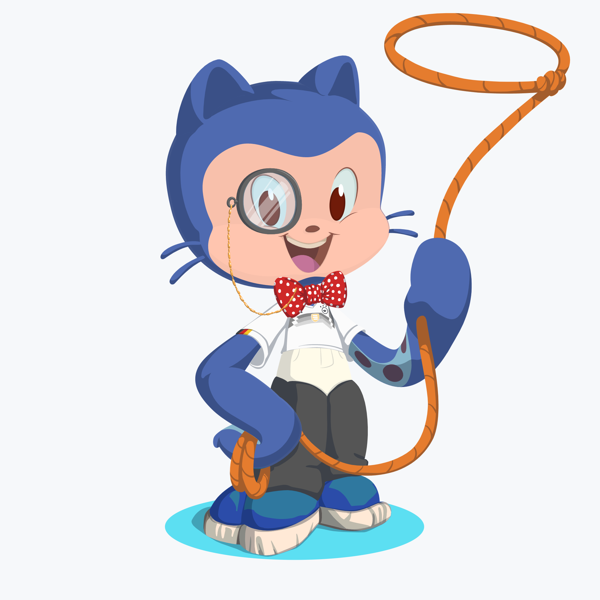

<body>

<h2 > <strong>Hello World! :earth_africa: </strong></h2>

Welcome to my GitHub profile.  Here I will try to add personal projects that I do to have fun.

</body>

<!--
**chunkjs/chunkjs** is a ✨ _special_ ✨ repository because its `README.md` (this file) appears on your GitHub profile.

Here are some ideas to get you started:

- 🔭 I’m currently working on ...
- 🌱 I’m currently learning ...
- 👯 I’m looking to collaborate on ...
- 🤔 I’m looking for help with ...
- 💬 Ask me about ...
- 📫 How to reach me: ...
- 😄 Pronouns: ...
- ⚡ Fun fact: ...
-->
